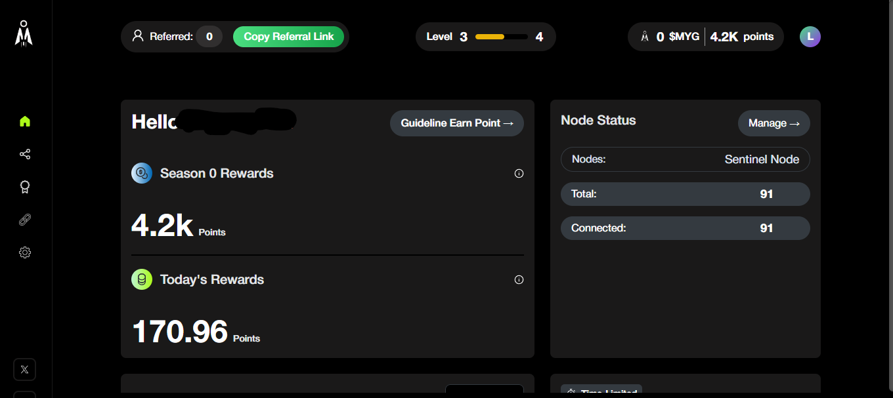
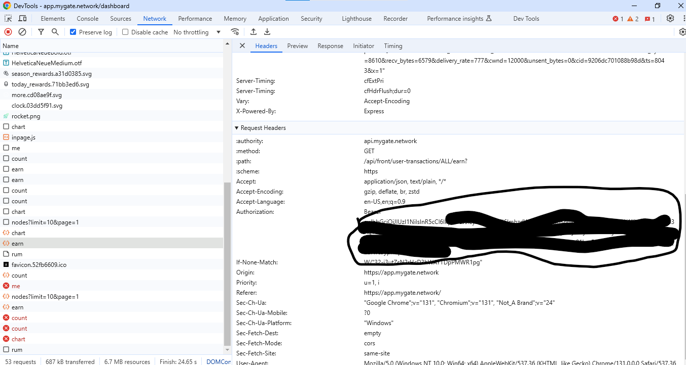

# MYGATE AI BOT


mygate-bot adalah script Python yang dirancang untuk menghasilkan Node ID baru, memeriksa kualitas node, dan menjaga koneksi tetap hidup dengan sinkronisasi setiap 5 detik. Script ini juga mendukung penggunaan proxy dan token otentikasi.
## REGISTER
https://app.mygate.network/login?code=voh8iE

Fitur Utama
Generate Node ID Baru : Menghasilkan ID unik untuk node baru.
Cek Kualitas Node : Memeriksa kualitas node menggunakan endpoint API.
Sinkronisasi Otomatis : Menjaga koneksi tetap hidup dengan melakukan sinkronisasi setiap 5 detik.
Dukungan Proxy : Mendukung penggunaan daftar proxy dari file proxy.txt.
Token Otentikasi : Memuat token otentikasi dari file token.txt.
Persyaratan Sistem
Sebelum menjalankan script, pastikan Anda telah memenuhi persyaratan berikut:

Python 3.x : Unduh dan instal Python dari https://www.python.org/downloads/ .
Library Python :
requests
rich
Instalasi
1. Instal Python
Unduh Python dari https://www.python.org/downloads/ .
Instal Python dan pastikan untuk mencentang opsi "Add Python to PATH" selama proses instalasi.
2. Instal Library Python
Buka Command Prompt atau PowerShell dan jalankan perintah berikut untuk menginstal library yang diperlukan:
1. clone repo
```bash
git clone https://github.com/adhe222/Mygate-bot.git
cd Mygate-bot
```
2. install depence
```bash
pip install requests rich
```
3. Siapkan File Pendukung
Pastikan Anda memiliki file berikut di direktori yang sama dengan script:

proxy.txt : Berisi daftar proxy dalam format berikut:
```bash
http://proxy1:port
http://proxy2:port
```
token.txt : Berisi token otentikasi dalam satu baris:

eyJhbGciOiJIUzI1NiIsInR5cCI6IkpXVCJ9...

## Jalankan bot
```bash
python mygate.py
```
3. Output
Script akan menampilkan output berikut:
Status Node : Informasi tentang pembuatan node dan kualitas node.
Proxy yang Digunakan : Proxy yang berhasil terkoneksi.
Waiting for 5 seconds before the next sync...
Konfigurasi
1. File proxy.txt
File ini berisi daftar proxy yang akan digunakan oleh script. Setiap baris harus berisi satu proxy dalam format berikut:
```bash
http://proxy1:port
http://proxy2:port
```
Troubleshooting
1. Error: 'python' is not recognized as an internal or external command
Pastikan Python telah ditambahkan ke PATH. Lihat panduan instalasi Python di atas.
2. Error: ModuleNotFoundError: No module named 'requests'
Pastikan Anda telah menginstal library requests dengan menjalankan:
bash
Copy
1
pip install requests
3. Error: File proxy.txt not found
Pastikan file proxy.txt ada di direktori yang sama dengan script.
4. Error: File token.txt not found
Pastikan file token.txt ada di direktori yang sama dengan script dan berisi token yang valid.
